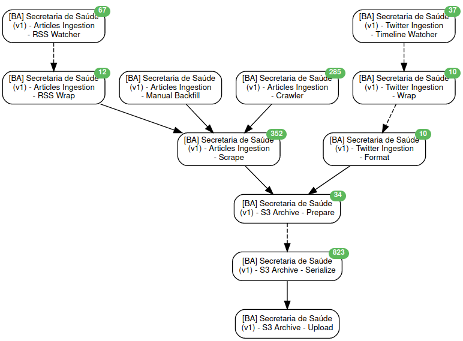

# [covid19br.pub](https://covid19br.pub)

Projeto de monitoramento de publicações oficiais relacionadas a COVID-19 no
Brasil.

## Tecnologias utilizadas

* Ruby on Rails
* PostgreSQL
* Huginn

## Arquitetura do projeto

_Alto nível, mais informações podem ser disponibilizadas caso haja interesse_

O processo de _scraping_ (ou raspagem) é feito por uma série de agentes
configurados numa instância de um [fork](https://github.com/fgrehm/covid19br-pub-agents)
do [Huginn](https://github.com/huginn/huginn) (a configuração dos agentes pode
ser encontrada [aqui](https://github.com/fgrehm/covid19br-pub-scenarios)). Cada
fonte monitorada possui um cenário do Huginn composto por diversos agentes que
trabalham numa parte do processo de scraping:

Eventualmente as informações são enviadas para um Bucket do S3 que é monitorado
por um outro conjunto de agentes. Estes agentes são responsáveis por notificar
esta aplicação Rails (esse projeto) sobre novas publicações encontradas:

Esta aplicação é responsável por processar os dados e determinar se determinada
publicação é relevante ou não. Além de servir como porta de entrada para
visualização das informações.

## Projetos relacionados

* https://github.com/fgrehm/covid19br-pub-agents - Fork do [Huginn](https://github.com/huginn/huginn)
  com algumas [poucas alterações](https://github.com/fgrehm/covid19br-pub-agents/compare/upstream...master)
* https://github.com/fgrehm/covid19br-pub-scenarios - Gerador de cenários para o
  Huginn.

## Quer ajudar?

Para mais informações sobre como ajudar e próximas etapas basta olhar os
[projetos](https://github.com/fgrehm/covid19br-pub/projects) ou
[issues](https://github.com/fgrehm/covid19br-pub/issues) em aberto. Fique a
vontade para mandar feedbacks e bug via issues também :)
